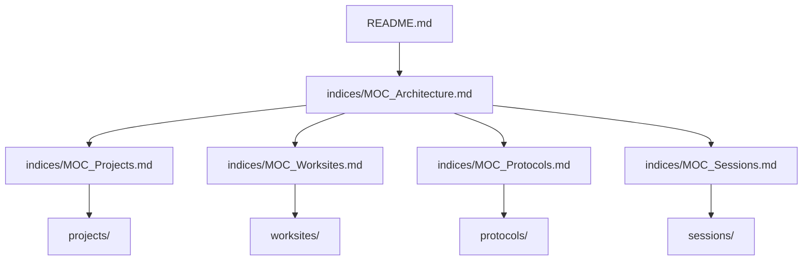

# MOC Architecture

This Map of Content (MOC) defines the entry topology and rules of Vault Upsilon. Coding agents must use this node to orient themselves and find other indices and modules.

## Structural Design
Vault Upsilon is built as an agentic memory model. Instead of scanning directories (which wastes valuable context tokens), agents must follow wikilinks to jump between nodes.

## Folder Descriptions
- **`indices/`**: Contain the MOCs. They map the entire memory space semantically.
- **`projects/`**: Houses long-lived, stable, or system project definitions.
- **`worksites/`**: Contains active worksites where multiple agents iterate in parallel.
- **`sessions/`**: Contains chronological session notes serving as workspace handoffs.
- **`protocols/`**: Registry of execution protocols (recipes and procedures).
- **`knowledge_base/`**: Stable knowledge base & agent configurations (contains [[Agent_Integration]]).
- **`dump/`**: Unstructured temp notes and logs.
- **`scripts/`**: Tooling for validation, token optimization, and orchestration.

## Core Rules for Agents
1. **Never Orphan a Node**: Every created node must have at least one incoming or outgoing `[[WikiLink]]` to/from a relevant MOC or project node.
2. **Mandatory Handoff**: Every significant block of work must conclude with a session note in `sessions/` linking to the active project.
3. **Commit often**: Keep the workspace clean and commit changes to git before concluding a session.
4. **Token Management**: Run `python3 scripts/token_optimizer.py` before starting a session to keep context sizes low.

---
[[MOC_Projects]] | [[MOC_Worksites]] | [[MOC_Protocols]] | [[MOC_Sessions]]
